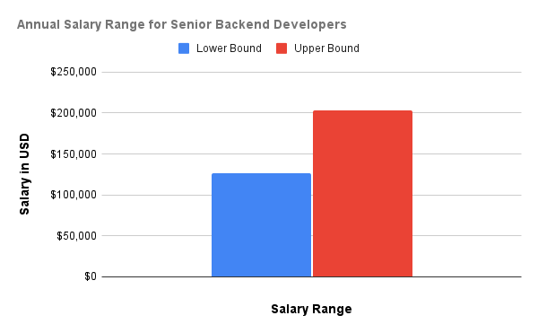
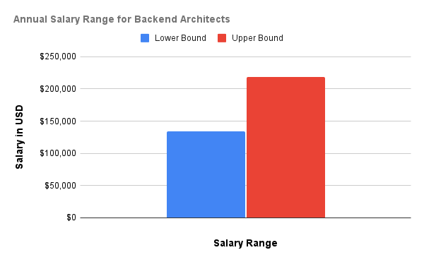
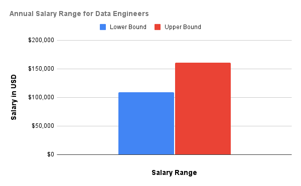

The main goal of every tech company is to grow and to accomplish this; they know they need to find the most talented software engineers and convince them to join their team.

As we all know, backend development is a lucrative profession in the tech industry, with numerous high-paying positions.

Most companies are eager to outperform each other in terms of benefits and salary when bringing in a member. On that note, let's look at some of the highest-paid backend roles and why they're so valued.

## **Senior Backend Developer**

A Senior Backend Developer is an experienced programmer specializing in creating server-side logic for online applications.

They work on databases, application integration, and API development to help build the foundation that allows web applications to run efficiently and effectively. Their work is crucial for processing and managing data, implementing security measures, and improving server speed.

According to [Glassdoor.com](http://Glassdoor.com) below are the salary ranges for backend engineering roles compared to others.

### **Salary**

Senior backend developers in the United States can earn anywhere from $126,000 to $203,000 per year, based on their experience and the company they work for.

## **Backend Architect**

Backend architects are the masterminds behind software programs and systems. They create the foundation of applications, focusing on server logic, databases, and data processing. Their primary purpose is to ensure that the program runs smoothly, manages data efficiently, and is safe.

The demand for backend architects is on the rise, fueled by the increasing complexity of software applications and the need for scalable and secure backend systems. Companies across various industries, from e-commerce to finance, require these experts to develop and maintain their backend infrastructure.

### **Salary**

Backend architects with several years of experience can expect to earn between $134,000 and $218,000 per year. As you gain experience working on more complex projects and showing proficiency in backend design, your salary is likely to increase.

## **Cloud Engineer**

A cloud engineer is an IT professional who creates and manages cloud infrastructure. Cloud engineers can take on more particular jobs, such as cloud architecting (creating cloud solutions for businesses), development (coding for the cloud), and administration (working with cloud networks).

Cloud technology has been around for some years, and we use cloud-based technology frequently in our everyday lives. Because of cloud technology, you can watch TV, listen to music on your favorite streaming platform, use an online email platform, or back up your phone pictures to the internet.

For a company, their data can be stored and backed up more easily, their software updates can be rolled out on-demand, and their customers can access their information from different devices. You’ll work behind the scenes as a cloud engineer to keep it all running.

### **Salary**

A cloud engineer who specializes in backend services makes an average annual salary of $119,000 to $188,000. The ability to work with cloud technology is one of the most in-demand abilities.

.png>)

## **DevOps Engineer**

DevOps generally require significant organizational change. It requires the right people, a supportive culture, and tools. One of DevOps's biggest challenges is that employees often lack the necessary skills.

As a DevOps engineer, you need to know how developers work. This includes using tools to track code changes, reviewing each other's code, writing small tests to check their work, and following agile methods, which are ways to work efficiently and flexibly.

### **Salary**

DevOps engineers often earn between $116,000 and $172,000 per year.

.png>)

## **Data Engineer**

Data engineering is designing and building systems for collecting, storing, and analyzing data at scale. It is a vast field with applications in virtually every industry. Companies can collect a large amount of data, and they need the right people and technology to ensure it is in a highly usable state by the time it reaches data scientists and analysts.

### **Salary**

Data engineering is also a well-paying career, with annual salaries ranging from $109,000 to $161,000.

## **Why are they high-paying?**

Backend responsibilities require a deep knowledge of programming languages, database management, and server administration. For that reason, the jobs are high-paying.

- These jobs often involve tackling tough technical problems, so you need strong problem-solving skills and plenty of experience.
- Backend developers ensure that apps run smoothly and efficiently. Their work is vital for web services' performance, security, and reliability.
- Backend architects and senior developers are responsible for making key decisions that affect the entire software system which means jobs like that can’t be given to just any person, you must be an expert to be able to land such a job.
- There's a high demand for skilled backend developers because now, businesses depend a lot more on technology and digital platforms. And obviously, this high demand also means higher salaries.
- Cloud engineering, DevOps, and data engineering skills are in high demand because they are required for modern app deployment and data management.
- High-paying jobs usually require several years of experience, so senior developers and architects have valuable knowledge that companies need.

## **Conclusion**

Backend development offers a variety of high-paying jobs, each of them with its task and needed skill. They pay well because they involve complex technical work, have a big impact on businesses, are in high demand, require specialized skills, and, most importantly, need a lot of experience.

All salary information are gotten from Glassdoor.com
